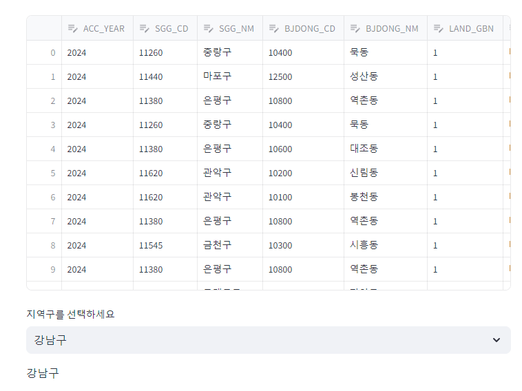

# 프로젝트 목적
부동산 데이터를 활용하여 대시보드를 개발하는 주요 목적은 다음과 같다.  
- 부동산 시장 동향을 시각화하고 사용자에게 부동산 투자 결정을 돕기 위함입니다. 
- 이를 통해 사용자는 지역별 가격 변동, 투자 수익률 예측 및 부동산 시장의 트렌드를 쉽게 파악하고 최적의 부동산 투자 전략을 수립할 수 있도록 도와주기 위함입니다.

# 팀원 소개
- 00팀원 : 깃허브 주소 공유
- 00팀원 : 깃허브 주고 공유

# 팀 역할 
- 00팀원 : 데이터 분석 
- 00팀원 : 대시보드 개발 

# 프로젝트 상세 개요 
- Period : 2024-03-02 ~ 2024-03-31
- Programming Languages : Python(ver.3.11.6), MySQL(8.0.31), R(4.1.0)
- Cloud : Google Cloud Platform
- Database : MySQL(8.0.31), BigQuery
- Web Framework : Streamlit (ver.1.28.1)

# 주요 라이브러리 버전
- [requirements.txt](requirements.txt) 파일 참조

# 데모페이지
- Streamlit에서 구현한 Demo는 다음과 같습니다. 
    + https://app-api-qkxzk2zdlacnuwxcqwxyyq.streamlit.app/

# 주요 기능
- 본 프로젝트에서 자체 개발 및 활용한 주요 메서드는 다음과 같습니다. 

| Functions | Location | Description |
|---|---|---|
| main | app.py  | for deploy |
| load_data | data_collect.py | for collecting data from API |

## main() 함수에 대한 구체적인 설명
- 00 함수는 ~~를 하는 것이다. 
- 예: 결과 이미지가 있으면 img 캡쳐 해주는 것이 좋음


# 발표자료 PDF 
- 공모전에서 입상한 발표자료 PDF는 아래와 같습니다. 
    + 링크 : [발표자료](docs/portfolio.pdf)

# Release Notes
- 개발 릴리스 노트는 'Releases' 클릭하여 주시기를 바랍니다. 

# License 
- [라이센스에 관련한 간단한 설명](LICENSE)

# 테스트 방법
- 다음과 같이 하면 된다. 
```
git clone https://github.com/dschloe/github-portfolio.git
virtualenv venv
pip install -r requirements.txt
source venv/Scripts/activate
streamlit run app.py
```